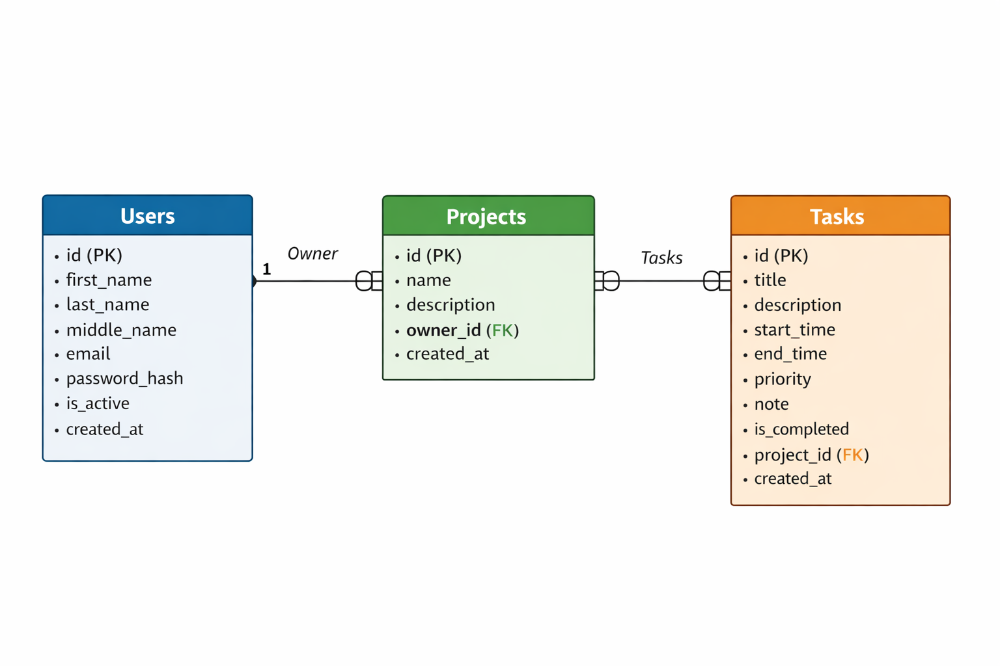

# 📝 FastAPI To-Do List Project

Современный и быстрый API для управления списком задач, упакованный в Docker и готовый к развертыванию.

---

 🛠 Технологический стек

•   Фреймворк: FastAP
•   База данных: PostgreSQL  
•   ORM: SQLAlchemy (Async)  
•   Миграции: Alembic  
•   Контейнеризация: Docker & Docker Compose  

---

 🚀 Быстрый старт

 1. Клонирование репозитория
```[git clone https://github.com/USERNAME/REPO.gitcd REPO](https://github.com/AlexEmelyanova/to_do_list.git)```

2. Настройка окружения (.env)
Создайте файл конфигурации из примера и отредактируйте его:
```cp .env.example .env.docker```

> 💡 Совет: Обязательно замените SECRET_KEY и пароли базы данных в .env перед запуском.

 3. Запуск в Docker
Все сервисы (API + База данных) запускаются одной командой:
```docker compose up --build```

Проект будет доступен по адресу: http://localhost:8000

---

 🏗 Управление базой данных (Alembic)

Если вы внесли изменения в модели данных, примените миграции следующей командой:

```docker compose exec app alembic upgrade head```

Для создания новой миграции после изменения моделей:

```docker compose exec app alembic revision --autogenerate -m "Ваше описание"```

---

 📖 Документация API

После запуска проекта интерактивная документация доступна здесь:

•   Swagger UI: http://localhost:8000/docs — лучший выбор для тестирования запросов.  
•   ReDoc: http://localhost:8000/redoc — чистая документация для чтения.

---

## ER Diagram


